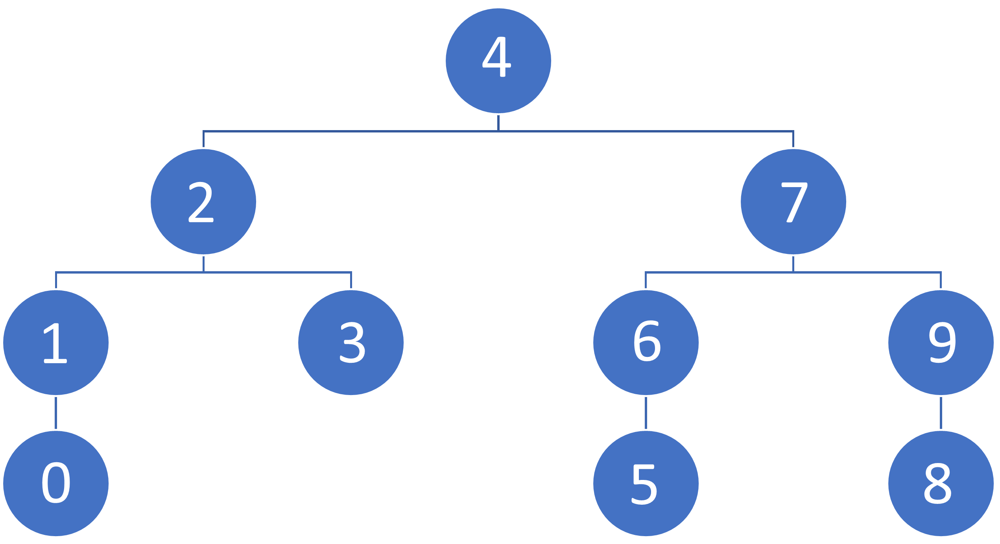

# Binary Search Tree Project #3

Assignment Link: [Patika.Dev Binary Search Tree Project Link](https://app.patika.dev/courses/veri-yapilari-ve-algoritmalar/binary-search-tree-proje)

## ❓Question 1 :

`[7,5,1,8,3,6,0,9,4,2]` please write down Binary-Search-Tree steps of the series.

### Step 1:

Sort the series.

```
[0,1,2,3,4,5,6,7,8,9]
```

### Step 2:

Select root. I selected the element **4** in this case.

### Step 3:

I selected 2 and 7 as roots and created the tree.



Enjoy 🚀 - Doruk

## My patika.dev profile:

<a href="https://app.patika.dev/kaolin"></a>
