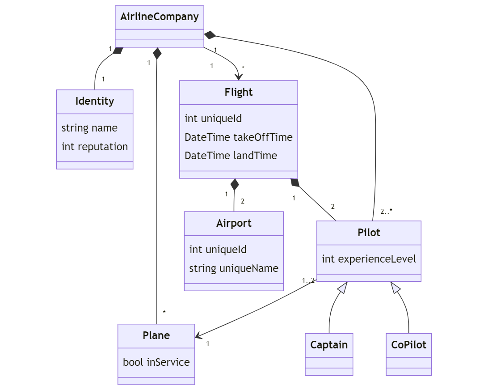

### [⬅️ Go Back](../../../README.md)

# OOP Airline Company System Homework

Assignment Link: [Patika.Dev OOP Homework #3](https://app.patika.dev/courses/oop/odev-flight)

## ❓Question 1 :

Please draw a UML diagram that describes the system below:

- Each airline company has an identity and they schedule flights.

- Airline company has different types of planes.

- Planes could be either in service or under maintenance

- Each flight has a unique id, takeoff/landing airport info and takeoff/landing time.

- Each flight has a pilot and a co-pilot. They operate the plane.

- Airports have unique ids.

- Airline companies have pilots and each pilot has an experience level.

- One plane need some number of pilots to operate.

## ✏️Answer 1 :

I have written mermaid syntax to generate the UML class diagram:

```c#
classDiagram
    class AirlineCompany
    class Identity {
        string name
        int reputation
    }
    class Plane {
        bool inService
    }
    class Flight {
        int uniqueId
        DateTime takeOffTime
        DateTime landTime
    }
    class Pilot {
        int experienceLevel
    }
    class Airport {
        int uniqueId
        string uniqueName
    }
    class Captain
    class CoPilot

AirlineCompany "1" *-- "1" Identity
Flight "1" *-- "2" Airport
Flight "1" *-- "2" Pilot
AirlineCompany "1" *-- "*" Plane
AirlineCompany "1" *-- "2..*" Pilot
AirlineCompany "1" --> "*" Flight
Pilot "1..2" --> "1" Plane
Pilot <|-- Captain
Pilot <|-- CoPilot
```

Output:



Enjoy 🚀 - Doruk

## My patika.dev profile:

<a href="https://app.patika.dev/kaolin"></a>
