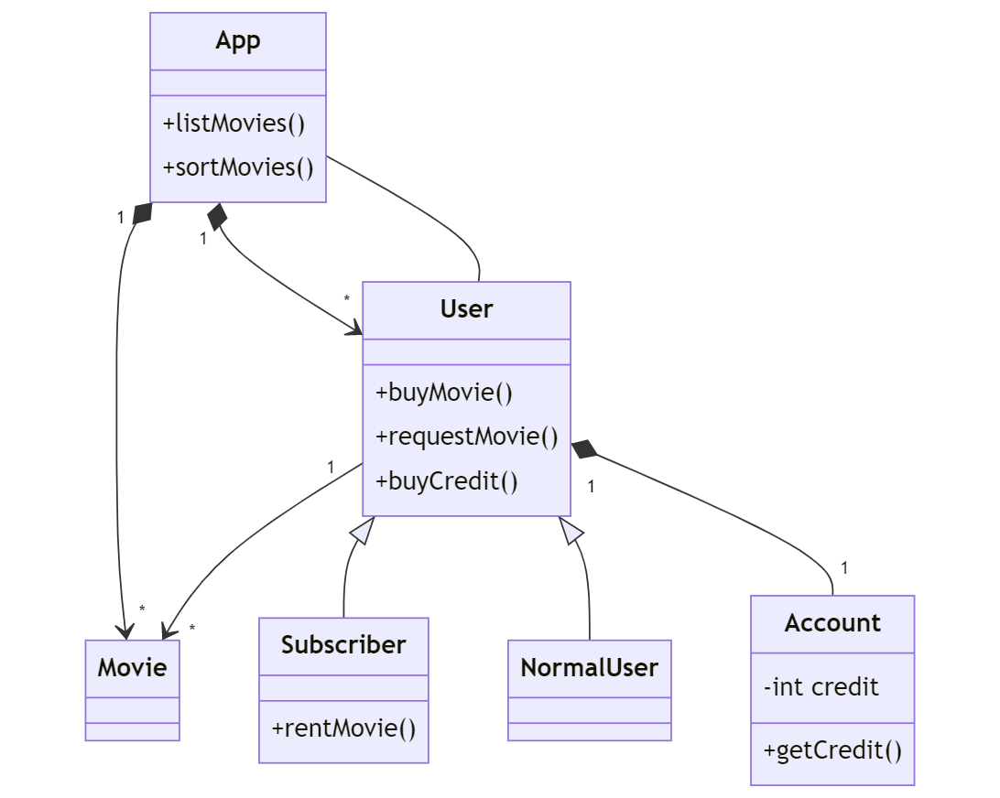

### [⬅️ Go Back](../../../README.md)

# OOP Online Movie System Homework

Assignment Link: [Patika.Dev OOP Homework #4](https://app.patika.dev/courses/oop/odev-film)

## ❓Question 1 :

Please draw a UML class diagram that describes the system below:

- Movies can be listed, sorted and users can subscribe to the app.

- Users purchase credits on the system.

- Only the subscribed users can rent movies, the amount is deducted from the account.

- Normal users and subscribers can puchase movies.

- Users can submit request for movies that are not available on the system.

## ✏️Answer 1 :

I have written mermaid syntax to generate the UML class diagram:

```c#
classDiagram
    class App {
        +listMovies()
        +sortMovies()
    }

    class Movie

    class User {
        +buyMovie()
        +requestMovie()
    }

    class Account {
        -int credit
        +getCredit()
    }

    class NormalUser {
        +buyCredit()
    }

    class Subscriber {
        +rentMovie()
    }

    App "1" *--> "*" Movie
    App "1" *--> "*" User
    User "1" --> "*" Movie
    User <|-- Subscriber
    User <|-- NormalUser
    User "1" *-- "1" Account
    User -- App
```

Output:



Enjoy 🚀 - Doruk

## My patika.dev profile:

<a href="https://app.patika.dev/kaolin"></a>
