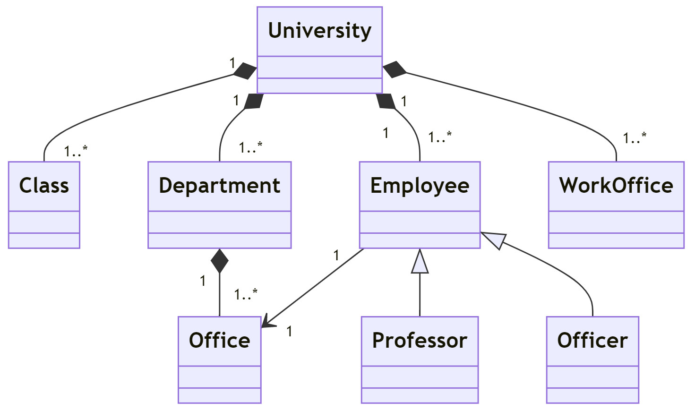

### [⬅️ Go Back](../../../README.md)

# OOP University Diagram Homework

Assignment Link: [Patika.Dev OOP Homework #1](https://app.patika.dev/courses/oop/odev-university)

## ❓Question 1 :

Please draw a UML diagram that describes the system below:

- A university has classes, work offices and departments.

- Departments have offices.

- University has employees that can be either a professor or an officer.

- Each employee works at an office.

**Note:** Feel no need to declare attributes and methods.

## ✏️Answer 1 :

I have used mermaid syntax to generate the UML class diagram:

```js
classDiagram
    class University
    class Class
    class Office
    class Department
    class Employee
    class Professor
    class Officer
    University "1" *-- "1..*" Class
    University "1" *-- "1..*" Department
    University "1" *-- "1..*" Employee
    University "1" *-- "1..*" WorkOffice
    Department "1" *-- "1..*" Office
    Employee <|-- Professor
    Employee <|-- Officer
    Employee "1" --> "1" Office
```

Output:



Enjoy 🚀 - Doruk

## My patika.dev profile:

<a href="https://app.patika.dev/kaolin"></a>
