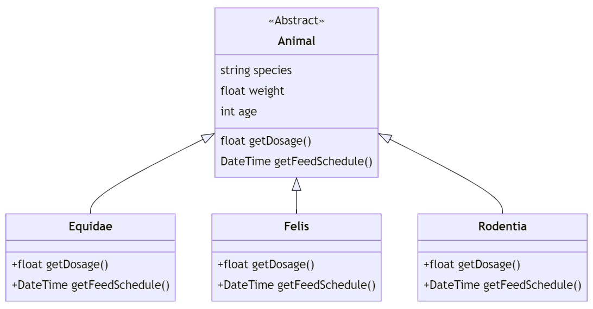

### [⬅️ Go Back](../../../README.md)

# OOP Zoo Management System Homework

Assignment Link: [Patika.Dev OOP Homework #2](https://app.patika.dev/courses/oop/odev-zoo)

## ❓Question 1 :

Please draw a UML diagram that describes the system below:

- Animal

- Equidae(Horse, Donkey...), Felis(Cat, Tiger...), Rodentia(Mouse...)

- Each animal has name of species, weight and age...

- System should return particular medicine dosage for each animal. (getDosage)

- System should calculate the feedschedule for each animal.

**Note:**
Use polymorphism for your diagram.

## ✏️Answer 1 :

I have written mermaid syntax to generate the UML class diagram:

```c#
classDiagram
    class Animal {
        <<Abstract>>
        string species
        float weight
        int age

        float getDosage()
        DateTime getFeedSchedule()
    }

    class Equidae {
        +float getDosage()
        +DateTime getFeedSchedule();
    }

    class Felis {
        +float getDosage()
        +DateTime getFeedSchedule();
    }

    class Rodentia {
        +float getDosage()
        +DateTime getFeedSchedule();
    }

    Animal <|-- Equidae
    Animal <|-- Felis
    Animal <|-- Rodentia
```

Output:



Enjoy 🚀 - Doruk

## My patika.dev profile:

<a href="https://app.patika.dev/kaolin"></a>
